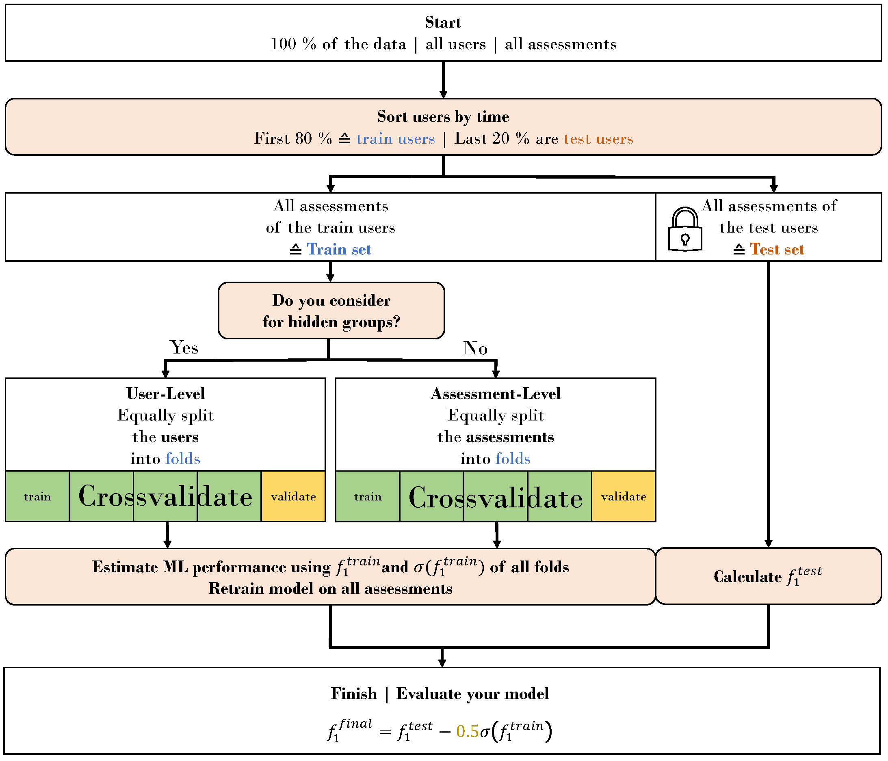

# From Hidden Groups to Robust Models: How To Better Estimate Performance Of Mobile Health Models

## Getting started
1. Request data from the author via **johannes.allgaier@uni-wuerzburg.de** and create a ``data`` folder in the root directory of this project.
2. Use the `requirements.txt` file to create a virtual environment within Python 3.9.
3. Code to replicate or extend the results can be found in ``src``.

## Highlights
1. Ignoring users (=groups) in assessments from mHealth data leads to overestimating the performance of the model after deployment and underestimating the impact of individual users on the generalizability of the model.
2. Depending on the use case, it may be worth considering a simple approach without machine learning, which we call a baseline heuristic. For some use cases, these baseline heuristics are better than non-tuned tree-based models.
3. If the time span of a data set is large, sorted users can be used to address concept drift, but this also increases the risk of selection bias on the part of the users in the test data.

## Train-Test split approach from methods

